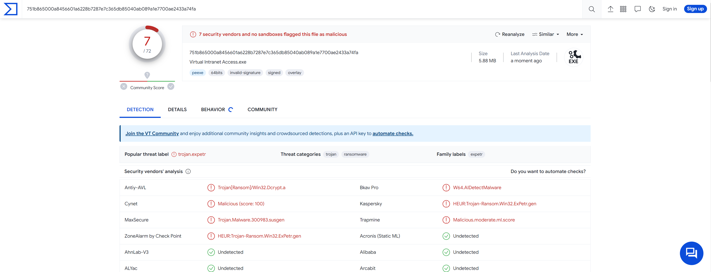
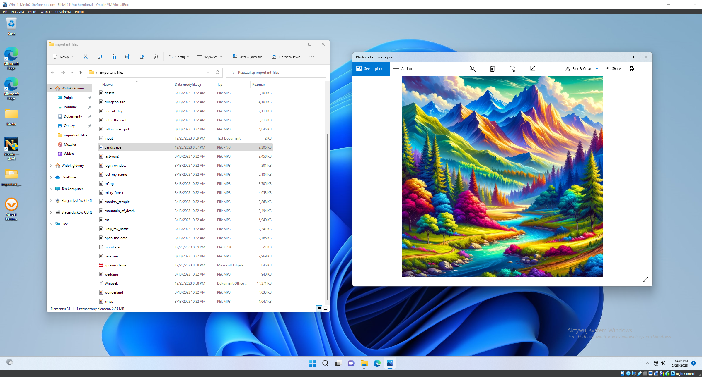
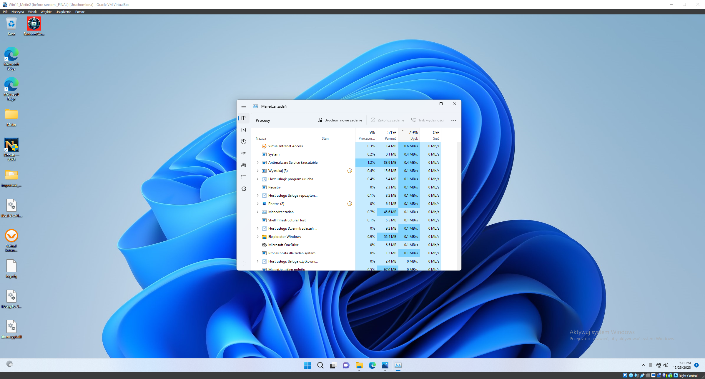
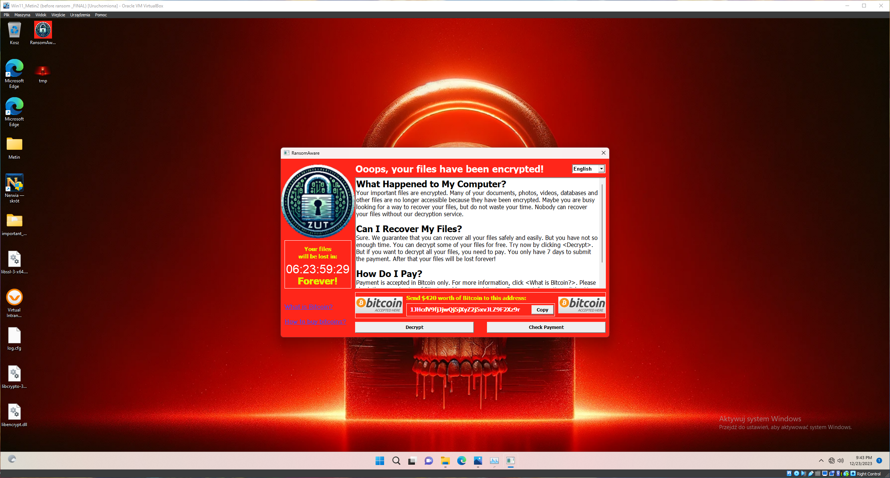
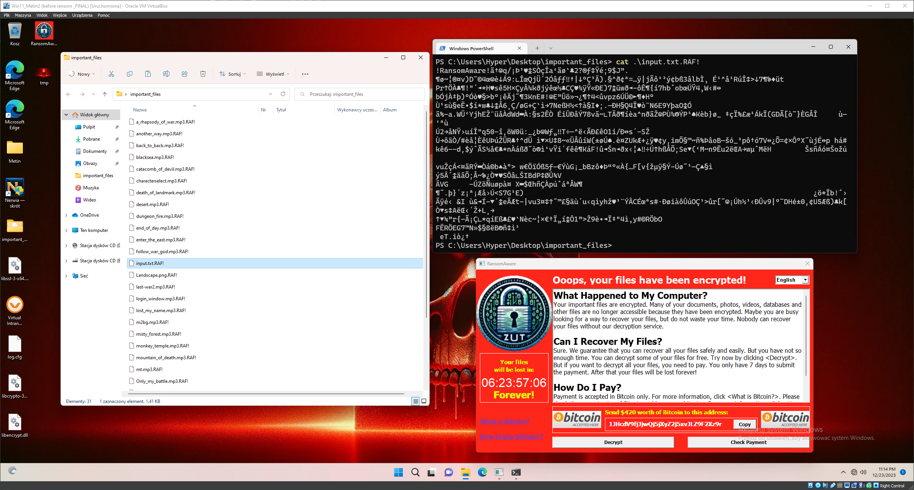
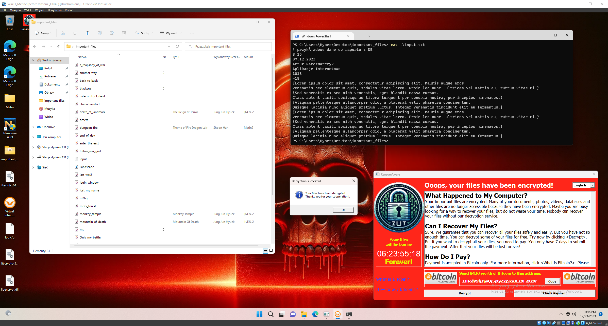

# **RansomAware**

## Overview
RansomAware is an educational C++ program designed to simulate a real ransomware attack. This project is part of my engineering thesis titled "RANSOMWARE FOR EDUCATIONAL PURPOSES". It aims to demonstrate the mechanics and dangers of ransomware attacks in a controlled environment for educational purposes.

## Technologies and Tools
- **Programming Language**: Entirely written in C/C++.
- **Development Environment**: Developed using Microsoft Visual Studio.
- **Simulation Environment**: Utilizes a secure VirtualBox environment running Windows 11.

## Features
- **Ransomware Simulation**: Mimics a real ransomware attack sequence.
- **Encryption Libraries**: Incorporates OpenSSL for AES128 and RSA2048 encryption.
- **String Encryption**: Uses XOR techniques for encrypting strings within the application, enhancing the overall security and obfuscation.
- **Disguise Mechanism**: Masquerades as a 'Virtual Intranet Access' application to encourage execution. It also uses misleading strings and information to obscure its true purpose and mislead analysis efforts.
- **Digital Signature Spoofing**: Utilizes stolen digital signatures ([SigThief](https://github.com/secretsquirrel/SigThief)) from Microsoft and Virtual Intranet Access .dll and .exe files.
- **Low System Resource Utilization**: Designed to consume minimal system resources, ensuring that the encryption process remains undetected by users and system monitoring tools until it's too late...
- **File Encryption**: Encrypts files with extensions such as .xlsl, .png, .mp3, while avoiding system-critical extensions like .dll, .exe, .dat to maintain system stability.
- **User Interface**: Changes desktop wallpaper and displays a GUI with decryption instructions upon encryption completion. Allowing easy decryption without payment for learning purposes (duh).
- **VirusTotal Detection Score**: Demonstrates a low detection rate with a score of 7/72 on VirusTotal, highlighting its stealth and sophistication. 

## Screenshots
### Before running Virtual Intranet Access.exe

### During encryption process

### After encryption process

### After 'payment'

## Installation and Usage
1. **Environment**: Recommended to run in a virtual, isolated environment like VirtualBox.
2. **Dependencies**: Requires Microsoft Visual C++ Redistributable.
3. **Supported Systems**: Compatible only with Windows architecture x64.

## TODO:
- **Ensure Persistence**: Develop functionality to add registry entries and run the program as a service to ensure its persistence in the system.
- **Enhanced Security Against Analysis**: Expand methods to protect against both static and dynamic analysis. This includes implementing debugger detection checks, code packing (packing), and virtualization techniques to further obfuscate and secure the program.

## Educational Purpose note
This project is strictly for educational purposes to understand and demonstrate the risks associated with ransomware attacks. It is crucial to use this software responsibly and ethically.
